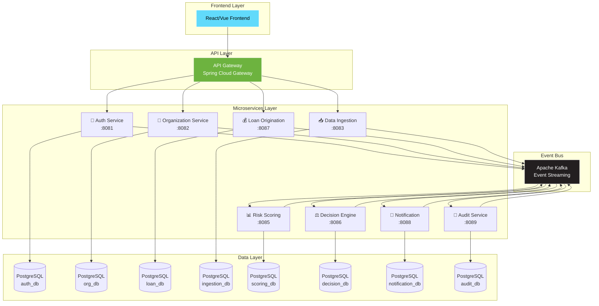
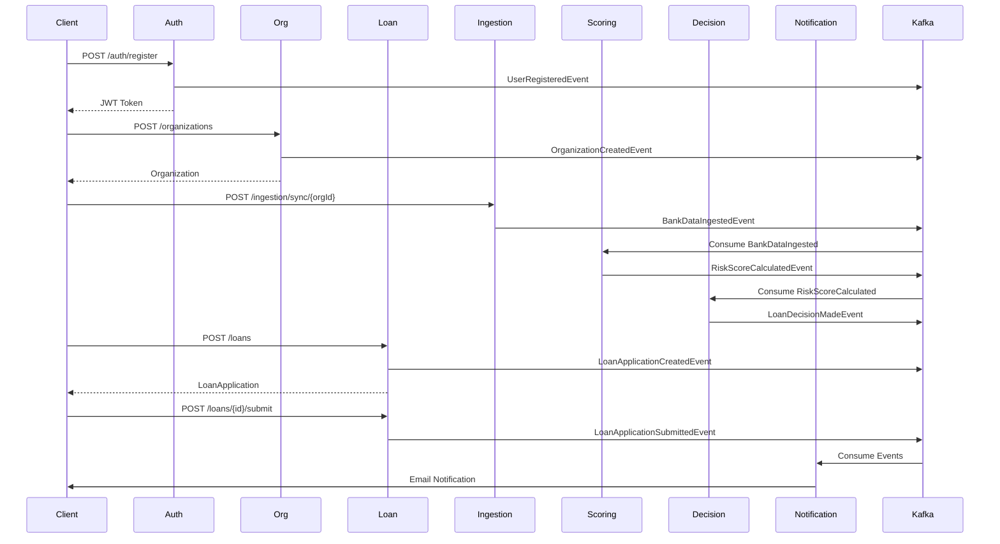

# 🚀 LoanLaunch - AI-Powered Intelligent Lending Platform

<div align="center">


**Plateforme de prêt intelligente pour petites entreprises basée sur l'IA et l'analyse de données alternatives**

[Documentation](#-documentation-api) • [Quick Start](#-démarrage-rapide) • [Architecture](#-architecture) • [API](#-endpoints-principaux)

</div>

---

## 🎯 Overview

LoanLaunch révolutionne le prêt aux petites entreprises en automatisant l'évaluation du risque grâce à l'analyse de données alternatives (cash-flow, SaaS metrics, open banking). 

**Résultat :** Décision de prêt en quelques heures au lieu de plusieurs semaines.

### ✨ Caractéristiques Principales

- 🏗️ **Architecture Microservices** - 8 services indépendants et scalables
- 📡 **Event-Driven** - Communication asynchrone via Apache Kafka
- 🔐 **Sécurité JWT** - Authentification et autorisation robustes
- 🐳 **Docker Ready** - Déploiement simplifié avec Docker Compose
- 📊 **Observabilité** - Health checks et monitoring intégrés
- 🎨 **Clean Architecture** - Hexagonal pattern pour chaque service

---

## 🏗️ Architecture

### Stack Technologique



### 🎯 Microservices Overview

<table>
<thead>
<tr>
<th>Service</th>
<th>Port</th>
<th>Database</th>
<th>Description</th>
<th>Responsabilités Clés</th>
</tr>
</thead>
<tbody>
<tr>
<td><strong>🏢 Organization Service</strong></td>
<td><code>8082</code></td>
<td><code>organization_db:5432</code></td>
<td>Gestion des organisations</td>
<td>• CRUD organisations<br/>• Gestion utilisateurs<br/>• Validation métier</td>
</tr>
<tr>
<td><strong>🔐 Auth Service</strong></td>
<td><code>8081</code></td>
<td><code>auth_db:5433</code></td>
<td>Authentification & Autorisation</td>
<td>• JWT tokens<br/>• Refresh tokens<br/>• Gestion rôles (BORROWER, UNDERWRITER, ADMIN)</td>
</tr>
<tr>
<td><strong>💰 Loan Origination</strong></td>
<td><code>8087</code></td>
<td><code>loan_db:5437</code></td>
<td>Gestion demandes de prêt</td>
<td>• Création demandes<br/>• Workflow statuts<br/>• Soumission pour évaluation</td>
</tr>
<tr>
<td><strong>📥 Data Ingestion</strong></td>
<td><code>8083</code></td>
<td><code>ingestion_db:5434</code></td>
<td>Ingestion données bancaires</td>
<td>• Simulation Open Banking<br/>• Stockage transactions<br/>• Déclenchement normalisation</td>
</tr>
<tr>
<td><strong>📊 Risk Scoring</strong></td>
<td><code>8085</code></td>
<td><code>scoring_db:5435</code></td>
<td>Calcul scores de risque</td>
<td>• Analyse cash-flow<br/>• Scoring basé règles<br/>• Évaluation tendances</td>
</tr>
<tr>
<td><strong>⚖️ Decision Engine</strong></td>
<td><code>8086</code></td>
<td><code>decision_db:5436</code></td>
<td>Décisions automatiques</td>
<td>• Application règles métier<br/>• Décision APPROVE/REJECT<br/>• Révision manuelle</td>
</tr>
<tr>
<td><strong>📧 Notification</strong></td>
<td><code>8088</code></td>
<td><code>notification_db:5438</code></td>
<td>Envoi notifications</td>
<td>• Emails transactionnels<br/>• Templates<br/>• Historique envois</td>
</tr>
<tr>
<td><strong>📝 Audit Service</strong></td>
<td><code>8089</code></td>
<td><code>audit_db:5439</code></td>
<td>Audit & Compliance</td>
<td>• Event logging<br/>• Audit trail complet<br/>• Support compliance</td>
</tr>
</tbody>
</table>

---

## 🚀 Démarrage Rapide

### 📋 Prérequis

| Outil | Version Minimum | Vérification |
|-------|----------------|--------------|
| ☕ Java | 21 | `java --version` |
| 📦 Maven | 3.9+ | `mvn --version` |
| 🐳 Docker | 20.10+ | `docker --version` |
| 🐙 Docker Compose | 2.0+ | `docker-compose --version` |

### ⚡ Installation en 3 Étapes

#### 1️⃣ Build du projet

```bash
# Clone le repository
git clone <your-repo-url>
cd LoanLaunch

# Build tous les services (compilation parallèle)
mvn clean package -T 4 -DskipTests
```

**Temps estimé:** ~2-3 minutes

#### 2️⃣ Lancer l'infrastructure

```bash
# Démarrer tous les services
docker-compose up -d

# Vérifier le statut
docker-compose ps
```

**Services démarrés:**
- ✅ 8 Microservices
- ✅ 8 Bases PostgreSQL
- ✅ Kafka + Zookeeper
- ✅ Kafka UI

#### 3️⃣ Vérifier le déploiement

```bash
# Health checks
curl http://localhost:8082/api/actuator/health  # Organization Service
curl http://localhost:8081/api/actuator/health  # Auth Service
curl http://localhost:8087/api/actuator/health  # Loan Service

# Kafka UI
open http://localhost:8090
```

> 💡 **Astuce:** Tous les services exposent leur documentation Swagger sur `/api/swagger-ui.html`

## 📡 Endpoints Principaux

### Organization Service (8082)
- `POST /api/organizations` - Créer une organisation
- `GET /api/organizations/{id}` - Obtenir une organisation
- `GET /api/organizations` - Lister les organisations

### Auth Service (8081)
- `POST /api/auth/register` - Inscription utilisateur
- `POST /api/auth/login` - Connexion
- `POST /api/auth/refresh` - Rafraîchir le token

### Loan Origination Service (8087)
- `POST /api/loans` - Créer une demande de prêt
- `POST /api/loans/{id}/submit` - Soumettre une demande
- `GET /api/loans/{id}` - Obtenir une demande
- `GET /api/loans/organization/{orgId}` - Lister les demandes par organisation

### Data Ingestion Service (8083)
- `POST /api/ingestion/sync/{organizationId}` - Synchroniser les données bancaires

## 🔄 Flow End-to-End



## 📊 Événements Kafka

### Topics

- `organization-events` - Événements d'organisation
- `user-events` - Événements utilisateur
- `loan-events` - Événements de prêt
- `data-ingestion-events` - Événements d'ingestion
- `risk-scoring-events` - Événements de scoring
- `decision-events` - Événements de décision

## 🗄️ Bases de Données

Chaque service a sa propre base PostgreSQL :

- `organization_db` (port 5432)
- `auth_db` (port 5433)
- `ingestion_db` (port 5434)
- `scoring_db` (port 5435)
- `decision_db` (port 5436)
- `loan_db` (port 5437)
- `notification_db` (port 5438)
- `audit_db` (port 5439)

## 📝 Documentation API

Chaque service expose sa documentation Swagger :

- Organization: http://localhost:8082/api/swagger-ui.html
- Auth: http://localhost:8081/api/swagger-ui.html
- Loan: http://localhost:8087/api/swagger-ui.html

## 🔍 Monitoring

- **Kafka UI**: http://localhost:8090
- **Health Checks**: `/api/actuator/health` sur chaque service

## 🧪 Tests

### Test Complet du Flow

1. **Créer une organisation**
```bash
curl -X POST http://localhost:8082/api/organizations \
  -H "Content-Type: application/json" \
  -d '{
    "name": "Tech Startup Inc",
    "legalName": "Tech Startup Incorporated",
    "taxId": "12-3456789",
    "industry": "Technology",
    "email": "contact@techstartup.com"
  }'
```

2. **Enregistrer un utilisateur**
```bash
curl -X POST http://localhost:8081/api/auth/register \
  -H "Content-Type: application/json" \
  -d '{
    "email": "john@techstartup.com",
    "password": "SecurePass123!",
    "role": "BORROWER",
    "organizationId": "<ORG_ID>"
  }'
```

3. **Créer une demande de prêt**
```bash
curl -X POST "http://localhost:8087/api/loans?organizationId=<ORG_ID>&requestedAmount=50000&requestedTermMonths=24&purpose=Equipment+purchase"
```

4. **Soumettre la demande**
```bash
curl -X POST http://localhost:8087/api/loans/<LOAN_ID>/submit
```

## �️ Développement

### Structure du Projet

```
loan-launch/
├── loan-launch-common/          # Bibliothèque partagée
├── loan-launch-events/          # Événements Kafka
├── organization-service/        # Service organisations
├── auth-service/                # Service authentification
├── loan-origination-service/    # Service prêts
├── data-ingestion-service/      # Service ingestion
├── risk-scoring-service/        # Service scoring
├── decision-engine-service/     # Service décision
├── notification-service/        # Service notifications
└── audit-service/               # Service audit
```

### Build d'un Service Spécifique

```bash
mvn clean package -pl <service-name> -am -DskipTests
```

### Logs

```bash
# Tous les services
docker-compose logs -f

# Service spécifique
docker-compose logs -f organization-service
```

## 🔐 Sécurité

- Authentification JWT sur tous les endpoints (sauf /auth/*)
- Tokens avec expiration (24h pour access, 7j pour refresh)
- Rôles: BORROWER, UNDERWRITER, ADMIN
- Passwords hashés avec BCrypt

## 📈 Prochaines Étapes

- [ ] Implémenter API Gateway avec Spring Cloud Gateway
- [ ] Ajouter la logique métier complète pour chaque service
- [ ] Implémenter les consumers Kafka pour le flow event-driven
- [ ] Ajouter les tests d'intégration
- [ ] Implémenter le frontend
- [ ] Ajouter monitoring (Prometheus/Grafana)
- [ ] Ajouter distributed tracing (Zipkin)

## � License

[Your License]

## 👥 Contributors

[Your Team]
