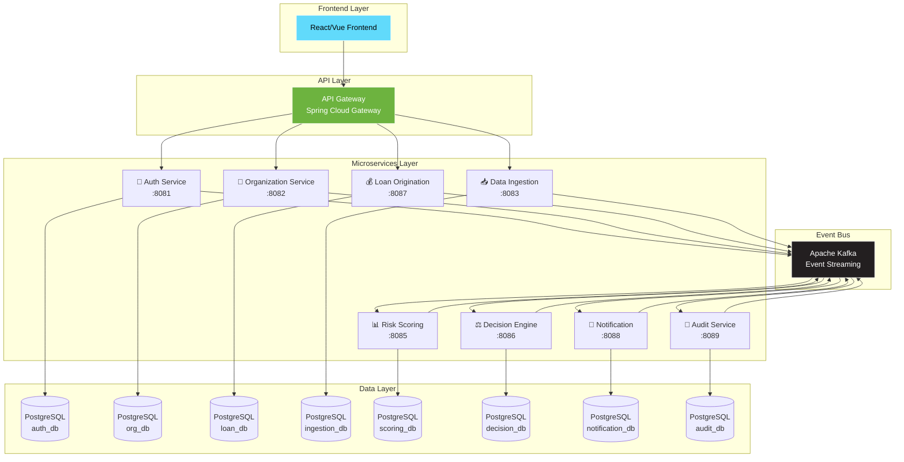
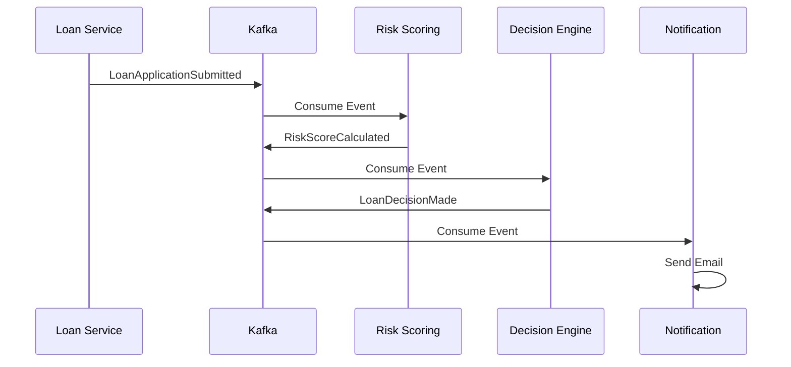
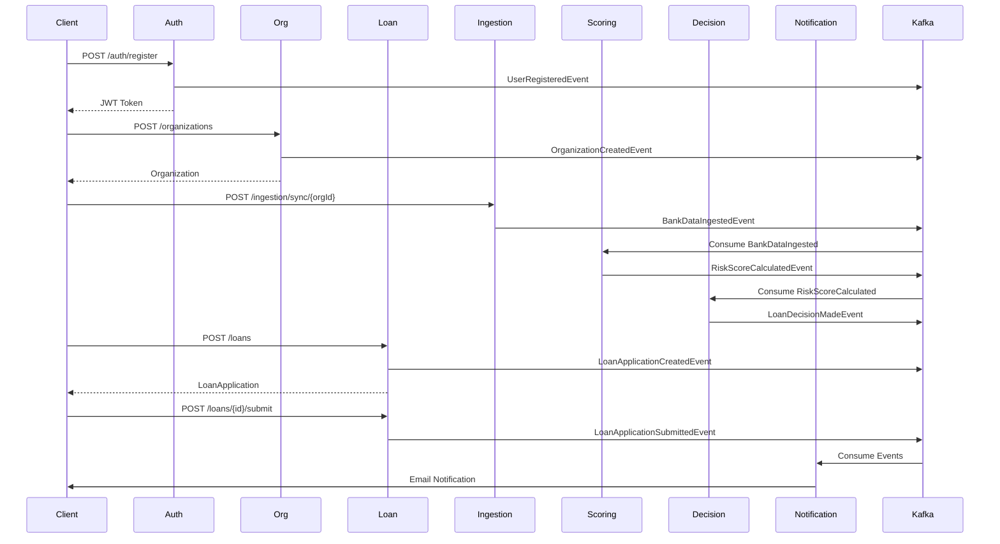

# 🚀 LoanLaunch - AI-Powered Intelligent Lending Platform

<div align="center">


**Plateforme de prêt intelligente pour petites entreprises basée sur l'IA et l'analyse de données alternatives**

[Documentation](#-documentation-api) • [Quick Start](#-démarrage-rapide) • [Architecture](#-architecture) • [API](#-endpoints-principaux)

</div>

---

## 🎯 Overview

LoanLaunch révolutionne le prêt aux petites entreprises en automatisant l'évaluation du risque grâce à l'analyse de données alternatives (cash-flow, SaaS metrics, open banking). 

**Résultat :** Décision de prêt en quelques heures au lieu de plusieurs semaines.

### ✨ Caractéristiques Principales

- 🏗️ **Architecture Microservices** - 8 services indépendants et scalables
- 📡 **Event-Driven** - Communication asynchrone via Apache Kafka
- 🔐 **Sécurité JWT** - Authentification et autorisation robustes
- 🐳 **Docker Ready** - Déploiement simplifié avec Docker Compose
- 📊 **Observabilité** - Health checks et monitoring intégrés
- 🎨 **Clean Architecture** - Hexagonal pattern pour chaque service

---

## 🏗️ Architecture

### Stack Technologique



### 🎯 Microservices Overview

<table>
<thead>
<tr>
<th>Service</th>
<th>Port</th>
<th>Database</th>
<th>Description</th>
<th>Responsabilités Clés</th>
</tr>
</thead>
<tbody>
<tr>
<td><strong>🏢 Organization Service</strong></td>
<td><code>8082</code></td>
<td><code>organization_db:5432</code></td>
<td>Gestion des organisations</td>
<td>• CRUD organisations<br/>• Gestion utilisateurs<br/>• Validation métier</td>
</tr>
<tr>
<td><strong>🔐 Auth Service</strong></td>
<td><code>8081</code></td>
<td><code>auth_db:5433</code></td>
<td>Authentification & Autorisation</td>
<td>• JWT tokens<br/>• Refresh tokens<br/>• Gestion rôles (BORROWER, UNDERWRITER, ADMIN)</td>
</tr>
<tr>
<td><strong>💰 Loan Origination</strong></td>
<td><code>8087</code></td>
<td><code>loan_db:5437</code></td>
<td>Gestion demandes de prêt</td>
<td>• Création demandes<br/>• Workflow statuts<br/>• Soumission pour évaluation</td>
</tr>
<tr>
<td><strong>📥 Data Ingestion</strong></td>
<td><code>8083</code></td>
<td><code>ingestion_db:5434</code></td>
<td>Ingestion données bancaires</td>
<td>• Simulation Open Banking<br/>• Stockage transactions<br/>• Déclenchement normalisation</td>
</tr>
<tr>
<td><strong>📊 Risk Scoring</strong></td>
<td><code>8085</code></td>
<td><code>scoring_db:5435</code></td>
<td>Calcul scores de risque</td>
<td>• Analyse cash-flow<br/>• Scoring basé règles<br/>• Évaluation tendances</td>
</tr>
<tr>
<td><strong>⚖️ Decision Engine</strong></td>
<td><code>8086</code></td>
<td><code>decision_db:5436</code></td>
<td>Décisions automatiques</td>
<td>• Application règles métier<br/>• Décision APPROVE/REJECT<br/>• Révision manuelle</td>
</tr>
<tr>
<td><strong>📧 Notification</strong></td>
<td><code>8088</code></td>
<td><code>notification_db:5438</code></td>
<td>Envoi notifications</td>
<td>• Emails transactionnels<br/>• Templates<br/>• Historique envois</td>
</tr>
<tr>
<td><strong>📝 Audit Service</strong></td>
<td><code>8089</code></td>
<td><code>audit_db:5439</code></td>
<td>Audit & Compliance</td>
<td>• Event logging<br/>• Audit trail complet<br/>• Support compliance</td>
</tr>
</tbody>
</table>

---

## 🚀 Démarrage Rapide

### 📋 Prérequis

| Outil | Version Minimum | Vérification |
|-------|----------------|--------------|
| ☕ Java | 21 | `java --version` |
| 📦 Maven | 3.9+ | `mvn --version` |
| 🐳 Docker | 20.10+ | `docker --version` |
| 🐙 Docker Compose | 2.0+ | `docker-compose --version` |

### ⚡ Installation en 3 Étapes

#### 1️⃣ Build du projet

```bash
# Clone le repository
git clone <your-repo-url>
cd LoanLaunch

# Build tous les services (compilation parallèle)
mvn clean package -T 4 -DskipTests
```

**Temps estimé:** ~2-3 minutes

#### 2️⃣ Lancer l'infrastructure

```bash
# Démarrer tous les services
docker-compose up -d

# Vérifier le statut
docker-compose ps
```

**Services démarrés:**
- ✅ 8 Microservices
- ✅ 8 Bases PostgreSQL
- ✅ Kafka + Zookeeper
- ✅ Kafka UI

#### 3️⃣ Vérifier le déploiement

```bash
# Health checks
curl http://localhost:8082/api/actuator/health  # Organization Service
curl http://localhost:8081/api/actuator/health  # Auth Service
curl http://localhost:8087/api/actuator/health  # Loan Service

# Kafka UI
open http://localhost:8090
```

> 💡 **Astuce:** Tous les services exposent leur documentation Swagger sur `/api/swagger-ui.html`

---

## 📡 Endpoints Principaux

### 🏢 Organization Service (`http://localhost:8082/api`)

| Méthode | Endpoint | Description | Auth |
|---------|----------|-------------|------|
| `POST` | `/organizations` | Créer une organisation | ❌ |
| `GET` | `/organizations/{id}` | Obtenir une organisation | ✅ |
| `GET` | `/organizations` | Lister (paginé) | ✅ |
| `PUT` | `/organizations/{id}` | Mettre à jour | ✅ |
| `DELETE` | `/organizations/{id}` | Supprimer | ✅ |

<details>
<summary>📝 Exemple: Créer une organisation</summary>

```bash
curl -X POST http://localhost:8082/api/organizations \
  -H "Content-Type: application/json" \
  -d '{
    "name": "Tech Startup Inc",
    "legalName": "Tech Startup Incorporated",
    "taxId": "12-3456789",
    "industry": "Technology",
    "email": "contact@techstartup.com",
    "phone": "+1234567890",
    "address": "123 Tech Street",
    "city": "San Francisco",
    "country": "USA"
  }'
```

**Réponse:**
```json
{
  "success": true,
  "message": "Organization created successfully",
  "data": {
    "id": "550e8400-e29b-41d4-a716-446655440000",
    "name": "Tech Startup Inc",
    "status": "PENDING",
    "createdAt": "2024-01-15T10:30:00Z"
  }
}
```
</details>

### 🔐 Auth Service (`http://localhost:8081/api`)

| Méthode | Endpoint | Description | Auth |
|---------|----------|-------------|------|
| `POST` | `/auth/register` | Inscription utilisateur | ❌ |
| `POST` | `/auth/login` | Connexion | ❌ |
| `POST` | `/auth/refresh` | Rafraîchir token | ❌ |
| `POST` | `/auth/logout` | Déconnexion | ✅ |

<details>
<summary>📝 Exemple: Register + Login</summary>

**1. Register:**
```bash
curl -X POST http://localhost:8081/api/auth/register \
  -H "Content-Type: application/json" \
  -d '{
    "email": "john@techstartup.com",
    "password": "SecurePass123!",
    "role": "BORROWER",
    "organizationId": "550e8400-e29b-41d4-a716-446655440000"
  }'
```

**2. Login:**
```bash
curl -X POST http://localhost:8081/api/auth/login \
  -H "Content-Type: application/json" \
  -d '{
    "email": "john@techstartup.com",
    "password": "SecurePass123!"
  }'
```

**Réponse:**
```json
{
  "accessToken": "eyJhbGciOiJIUzI1NiIsInR5cCI6IkpXVCJ9...",
  "refreshToken": "eyJhbGciOiJIUzI1NiIsInR5cCI6IkpXVCJ9...",
  "tokenType": "Bearer",
  "expiresIn": 86400,
  "user": {
    "id": "...",
    "email": "john@techstartup.com",
    "role": "BORROWER"
  }
}
```
</details>

### 💰 Loan Origination Service (`http://localhost:8087/api`)

| Méthode | Endpoint | Description | Auth |
|---------|----------|-------------|------|
| `POST` | `/loans` | Créer demande de prêt | ✅ |
| `POST` | `/loans/{id}/submit` | Soumettre pour évaluation | ✅ |
| `GET` | `/loans/{id}` | Obtenir une demande | ✅ |
| `GET` | `/loans/organization/{orgId}` | Lister par organisation | ✅ |

<details>
<summary>📝 Exemple: Flow complet demande de prêt</summary>

**1. Créer une demande:**
```bash
curl -X POST "http://localhost:8087/api/loans?organizationId=550e8400-e29b-41d4-a716-446655440000&requestedAmount=50000&requestedTermMonths=24&purpose=Equipment+purchase" \
  -H "Authorization: Bearer YOUR_JWT_TOKEN"
```

**2. Soumettre la demande:**
```bash
curl -X POST http://localhost:8087/api/loans/{LOAN_ID}/submit \
  -H "Authorization: Bearer YOUR_JWT_TOKEN"
```

**Statuts possibles:**
- `DRAFT` → Brouillon
- `SUBMITTED` → Soumise pour évaluation
- `UNDER_REVIEW` → En cours d'analyse
- `APPROVED` → Approuvée ✅
- `REJECTED` → Rejetée ❌
- `DISBURSED` → Fonds versés 💸
</details>

### 📥 Data Ingestion Service (`http://localhost:8083/api`)

| Méthode | Endpoint | Description |
|---------|----------|-------------|
| `POST` | `/ingestion/sync/{organizationId}` | Synchroniser données bancaires |

---

## 📊 Événements Kafka

### Topics Configurés

| Topic | Description | Producteurs | Consommateurs |
|-------|-------------|-------------|---------------|
| `organization-events` | Événements organisations | Organization Service | Audit Service |
| `user-events` | Événements utilisateurs | Auth Service | Audit, Notification |
| `loan-events` | Événements prêts | Loan Service | Decision, Notification, Audit |
| `data-ingestion-events` | Ingestion données | Ingestion Service | Normalization |
| `risk-scoring-events` | Scores de risque | Scoring Service | Decision, Audit |
| `decision-events` | Décisions prêt | Decision Service | Loan, Notification, Audit |

### 📨 Événements Clés



---

## �️ Bases de Données

### Configuration PostgreSQL

| Service | Database | Port | Tables Principales |
|---------|----------|------|-------------------|
| Organization | `organization_db` | 5432 | organizations, organization_users |
| Auth | `auth_db` | 5433 | users, refresh_tokens |
| Loan | `loan_db` | 5437 | loan_applications |
| Ingestion | `ingestion_db` | 5434 | raw_transactions |
| Scoring | `scoring_db` | 5435 | risk_assessments |
| Decision | `decision_db` | 5436 | loan_decisions |
| Notification | `notification_db` | 5438 | notifications |
| Audit | `audit_db` | 5439 | event_log |

**Migrations:** Toutes gérées par Flyway avec versioning

---

## 📝 Documentation API

### Swagger UI

Chaque service expose sa documentation interactive :

| Service | Swagger URL |
|---------|-------------|
| 🏢 Organization | http://localhost:8082/api/swagger-ui.html |
| 🔐 Auth | http://localhost:8081/api/swagger-ui.html |
| 💰 Loan | http://localhost:8087/api/swagger-ui.html |
| 📥 Ingestion | http://localhost:8083/api/swagger-ui.html |
| 📊 Scoring | http://localhost:8085/api/swagger-ui.html |
| ⚖️ Decision | http://localhost:8086/api/swagger-ui.html |

---

## 🔍 Monitoring & Observabilité

### Health Checks

Tous les services exposent des health checks via Spring Boot Actuator :

```bash
# Vérifier tous les services
for port in 8081 8082 8083 8085 8086 8087 8088 8089; do
  echo "Service on port $port:"
  curl -s http://localhost:$port/api/actuator/health | jq
done
```

### Kafka UI

Interface web pour monitorer Kafka :

- **URL:** http://localhost:8090
- **Features:**
  - 📊 Visualisation des topics
  - 📨 Inspection des messages
  - 👥 Gestion des consumer groups
  - 📈 Métriques en temps réel

### Logs

```bash
# Tous les services
docker-compose logs -f

# Service spécifique
docker-compose logs -f organization-service

# Dernières 100 lignes
docker-compose logs --tail=100 auth-service
```

---

## 🧪 Tests End-to-End

### Scénario Complet: Demande de Prêt

```bash
#!/bin/bash

# 1. Créer une organisation
ORG_RESPONSE=$(curl -s -X POST http://localhost:8082/api/organizations \
  -H "Content-Type: application/json" \
  -d '{
    "name": "Tech Startup Inc",
    "legalName": "Tech Startup Incorporated",
    "taxId": "12-3456789",
    "industry": "Technology",
    "email": "contact@techstartup.com"
  }')

ORG_ID=$(echo $ORG_RESPONSE | jq -r '.data.id')
echo "✅ Organization created: $ORG_ID"

# 2. Enregistrer un utilisateur
AUTH_RESPONSE=$(curl -s -X POST http://localhost:8081/api/auth/register \
  -H "Content-Type: application/json" \
  -d "{
    \"email\": \"john@techstartup.com\",
    \"password\": \"SecurePass123!\",
    \"role\": \"BORROWER\",
    \"organizationId\": \"$ORG_ID\"
  }")

TOKEN=$(echo $AUTH_RESPONSE | jq -r '.data.accessToken')
echo "✅ User registered, token obtained"

# 3. Créer une demande de prêt
LOAN_RESPONSE=$(curl -s -X POST \
  "http://localhost:8087/api/loans?organizationId=$ORG_ID&requestedAmount=50000&requestedTermMonths=24&purpose=Equipment+purchase" \
  -H "Authorization: Bearer $TOKEN")

LOAN_ID=$(echo $LOAN_RESPONSE | jq -r '.data.id')
echo "✅ Loan application created: $LOAN_ID"

# 4. Soumettre la demande
SUBMIT_RESPONSE=$(curl -s -X POST \
  "http://localhost:8087/api/loans/$LOAN_ID/submit" \
  -H "Authorization: Bearer $TOKEN")

echo "✅ Loan application submitted"
echo "📊 Status: $(echo $SUBMIT_RESPONSE | jq -r '.data.status')"

# 5. Vérifier dans Kafka UI
echo "🔍 Check Kafka UI: http://localhost:8090"
```

---

## 🛠️ Développement

### Structure du Projet

```
loan-launch/
├── 📦 loan-launch-common/          # Bibliothèque partagée
│   ├── domain/                     # BaseEntity
│   ├── dto/                        # ApiResponse, PageResponse
│   ├── exception/                  # Exceptions métier
│   └── config/                     # Configurations JPA
│
├── 📡 loan-launch-events/          # Événements Kafka
│   ├── base/                       # BaseEvent
│   ├── config/                     # KafkaConfig, Topics
│   ├── organization/               # OrganizationEvents
│   ├── user/                       # UserEvents
│   └── loan/                       # LoanEvents
│
├── 🏢 organization-service/        # Service organisations
├── 🔐 auth-service/                # Service authentification
├── 💰 loan-origination-service/    # Service prêts
├── 📥 data-ingestion-service/      # Service ingestion
├── 📊 risk-scoring-service/        # Service scoring
├── ⚖️ decision-engine-service/     # Service décision
├── 📧 notification-service/        # Service notifications
├── 📝 audit-service/               # Service audit
│
├── 🐳 docker-compose.yml           # Orchestration Docker
├── 📄 pom.xml                      # Parent POM
└── 📖 README.md                    # Cette documentation
```

### Build d'un Service Spécifique

```bash
# Compiler un service et ses dépendances
mvn clean compile -pl organization-service -am

# Package avec tests
mvn clean package -pl auth-service -am

# Package sans tests (plus rapide)
mvn clean package -pl loan-origination-service -am -DskipTests
```

### Hot Reload en Développement

```bash
# Utiliser spring-boot-devtools (déjà inclus)
mvn spring-boot:run -pl organization-service
```

---

## 🔐 Sécurité

### Authentification JWT

- **Algorithm:** HS256
- **Access Token:** 24 heures
- **Refresh Token:** 7 jours
- **Secret:** Configurable via `JWT_SECRET` env var

### Rôles & Permissions

| Rôle | Description | Permissions |
|------|-------------|-------------|
| `BORROWER` | Demandeur de prêt | Créer/consulter ses demandes |
| `UNDERWRITER` | Analyste crédit | Réviser/approuver demandes |
| `ADMIN` | Administrateur | Accès complet système |

### Best Practices Implémentées

- ✅ Passwords hashés avec BCrypt (cost factor: 10)
- ✅ Tokens JWT signés et vérifiés
- ✅ HTTPS recommandé en production
- ✅ Rate limiting (à implémenter via API Gateway)
- ✅ Input validation avec Bean Validation
- ✅ SQL injection protection via JPA/Hibernate

---

## 📈 Roadmap & Prochaines Étapes

### Phase 1: MVP ✅ (Complété)
- [x] Architecture microservices
- [x] 8 services fonctionnels
- [x] Event-driven avec Kafka
- [x] Authentification JWT
- [x] Docker ready

### Phase 2: Production Ready (En cours)
- [ ] API Gateway avec Spring Cloud Gateway
- [ ] Consumers Kafka pour tous les services
- [ ] Tests d'intégration avec Testcontainers
- [ ] CI/CD Pipeline (GitHub Actions)
- [ ] Monitoring (Prometheus + Grafana)

### Phase 3: Advanced Features
- [ ] Frontend React/Vue.js
- [ ] ML Model pour Risk Scoring
- [ ] Distributed Tracing (Zipkin/Jaeger)
- [ ] Service Mesh (Istio)
- [ ] Real Open Banking Integration
- [ ] Advanced Analytics Dashboard

### Phase 4: Scale & Optimize
- [ ] Kubernetes deployment
- [ ] Auto-scaling policies
- [ ] Multi-region deployment
- [ ] Performance optimization
- [ ] Load testing & benchmarks

---

## 🤝 Contributing

Contributions are welcome! Please feel free to submit a Pull Request.

1. Fork the project
2. Create your feature branch (`git checkout -b feature/AmazingFeature`)
3. Commit your changes (`git commit -m 'Add some AmazingFeature'`)
4. Push to the branch (`git push origin feature/AmazingFeature`)
5. Open a Pull Request

---

## 📄 License

This project is licensed under the MIT License - see the LICENSE file for details.

---

## 👥 Team

Built with ❤️ by the LoanLaunch Team

---

<div align="center">

**⭐ Si ce projet vous a aidé, n'hésitez pas à lui donner une étoile !**

[Documentation](https://your-docs-url) • [Issues](https://github.com/your-repo/issues) • [Discussions](https://github.com/your-repo/discussions)

</div>



## 📊 Événements Kafka

### Topics

- `organization-events` - Événements d'organisation
- `user-events` - Événements utilisateur
- `loan-events` - Événements de prêt
- `data-ingestion-events` - Événements d'ingestion
- `risk-scoring-events` - Événements de scoring
- `decision-events` - Événements de décision

## 🗄️ Bases de Données

Chaque service a sa propre base PostgreSQL :

- `organization_db` (port 5432)
- `auth_db` (port 5433)
- `ingestion_db` (port 5434)
- `scoring_db` (port 5435)
- `decision_db` (port 5436)
- `loan_db` (port 5437)
- `notification_db` (port 5438)
- `audit_db` (port 5439)

## 📝 Documentation API

Chaque service expose sa documentation Swagger :

- Organization: http://localhost:8082/api/swagger-ui.html
- Auth: http://localhost:8081/api/swagger-ui.html
- Loan: http://localhost:8087/api/swagger-ui.html

## 🔍 Monitoring

- **Kafka UI**: http://localhost:8090
- **Health Checks**: `/api/actuator/health` sur chaque service

## 🧪 Tests

### Test Complet du Flow

1. **Créer une organisation**
```bash
curl -X POST http://localhost:8082/api/organizations \
  -H "Content-Type: application/json" \
  -d '{
    "name": "Tech Startup Inc",
    "legalName": "Tech Startup Incorporated",
    "taxId": "12-3456789",
    "industry": "Technology",
    "email": "contact@techstartup.com"
  }'
```

2. **Enregistrer un utilisateur**
```bash
curl -X POST http://localhost:8081/api/auth/register \
  -H "Content-Type: application/json" \
  -d '{
    "email": "john@techstartup.com",
    "password": "SecurePass123!",
    "role": "BORROWER",
    "organizationId": "<ORG_ID>"
  }'
```

3. **Créer une demande de prêt**
```bash
curl -X POST "http://localhost:8087/api/loans?organizationId=<ORG_ID>&requestedAmount=50000&requestedTermMonths=24&purpose=Equipment+purchase"
```

4. **Soumettre la demande**
```bash
curl -X POST http://localhost:8087/api/loans/<LOAN_ID>/submit
```

## �️ Développement

### Structure du Projet

```
loan-launch/
├── loan-launch-common/          # Bibliothèque partagée
├── loan-launch-events/          # Événements Kafka
├── organization-service/        # Service organisations
├── auth-service/                # Service authentification
├── loan-origination-service/    # Service prêts
├── data-ingestion-service/      # Service ingestion
├── risk-scoring-service/        # Service scoring
├── decision-engine-service/     # Service décision
├── notification-service/        # Service notifications
└── audit-service/               # Service audit
```

### Build d'un Service Spécifique

```bash
mvn clean package -pl <service-name> -am -DskipTests
```

### Logs

```bash
# Tous les services
docker-compose logs -f

# Service spécifique
docker-compose logs -f organization-service
```

## 🔐 Sécurité

- Authentification JWT sur tous les endpoints (sauf /auth/*)
- Tokens avec expiration (24h pour access, 7j pour refresh)
- Rôles: BORROWER, UNDERWRITER, ADMIN
- Passwords hashés avec BCrypt

## 📈 Prochaines Étapes

- [ ] Implémenter API Gateway avec Spring Cloud Gateway
- [ ] Ajouter la logique métier complète pour chaque service
- [ ] Implémenter les consumers Kafka pour le flow event-driven
- [ ] Ajouter les tests d'intégration
- [ ] Implémenter le frontend
- [ ] Ajouter monitoring (Prometheus/Grafana)
- [ ] Ajouter distributed tracing (Zipkin)

## � License

[Your License]

## 👥 Contributors

[Your Team]
