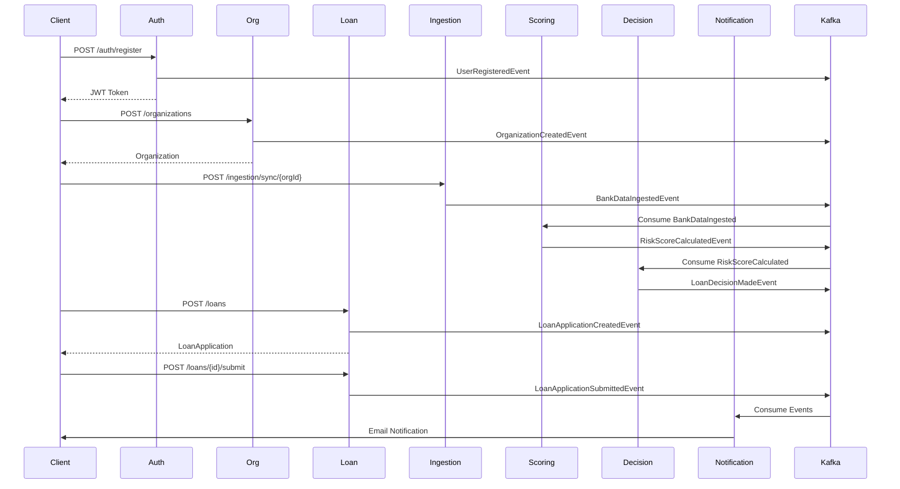

# LoanLaunch - AI-Powered Intelligent Lending Platform

## 🎯 Overview

LoanLaunch est une plateforme de prêt intelligente pour petites entreprises basée sur l'IA et l'analyse de données alternatives (cash-flow, SaaS, open banking). La plateforme automatise l'évaluation du risque pour fournir une décision de prêt en quelques heures au lieu de plusieurs semaines.

## 🏗️ Architecture

**Stack Technique :**
- Java 21
- Spring Boot 3.2.1
- Apache Kafka (event-driven)
- PostgreSQL (1 DB par service)
- Docker & Docker Compose
- Architecture Hexagonale

### Microservices (8 services)

| Service | Port | Description |
|---------|------|-------------|
| **organization-service** | 8082 | Gestion des organisations et utilisateurs |
| **auth-service** | 8081 | Authentification JWT et gestion des utilisateurs |
| **loan-origination-service** | 8087 | Gestion des demandes de prêt |
| **data-ingestion-service** | 8083 | Ingestion de données bancaires (simulé) |
| **risk-scoring-service** | 8085 | Calcul des scores de risque |
| **decision-engine-service** | 8086 | Moteur de décision automatique |
| **notification-service** | 8088 | Envoi de notifications |
| **audit-service** | 8089 | Journalisation et audit trail |

## 🚀 Démarrage Rapide

### Prérequis

- Java 21
- Maven 3.9+
- Docker & Docker Compose

### 1. Build du projet

```bash
mvn clean package -DskipTests
```

### 2. Lancer l'infrastructure

```bash
docker-compose up -d
```

### 3. Vérifier les services

```bash
docker-compose ps
```

## 📡 Endpoints Principaux

### Organization Service (8082)
- `POST /api/organizations` - Créer une organisation
- `GET /api/organizations/{id}` - Obtenir une organisation
- `GET /api/organizations` - Lister les organisations

### Auth Service (8081)
- `POST /api/auth/register` - Inscription utilisateur
- `POST /api/auth/login` - Connexion
- `POST /api/auth/refresh` - Rafraîchir le token

### Loan Origination Service (8087)
- `POST /api/loans` - Créer une demande de prêt
- `POST /api/loans/{id}/submit` - Soumettre une demande
- `GET /api/loans/{id}` - Obtenir une demande
- `GET /api/loans/organization/{orgId}` - Lister les demandes par organisation

### Data Ingestion Service (8083)
- `POST /api/ingestion/sync/{organizationId}` - Synchroniser les données bancaires

## 🔄 Flow End-to-End



## 📊 Événements Kafka

### Topics

- `organization-events` - Événements d'organisation
- `user-events` - Événements utilisateur
- `loan-events` - Événements de prêt
- `data-ingestion-events` - Événements d'ingestion
- `risk-scoring-events` - Événements de scoring
- `decision-events` - Événements de décision

## 🗄️ Bases de Données

Chaque service a sa propre base PostgreSQL :

- `organization_db` (port 5432)
- `auth_db` (port 5433)
- `ingestion_db` (port 5434)
- `scoring_db` (port 5435)
- `decision_db` (port 5436)
- `loan_db` (port 5437)
- `notification_db` (port 5438)
- `audit_db` (port 5439)

## 📝 Documentation API

Chaque service expose sa documentation Swagger :

- Organization: http://localhost:8082/api/swagger-ui.html
- Auth: http://localhost:8081/api/swagger-ui.html
- Loan: http://localhost:8087/api/swagger-ui.html

## 🔍 Monitoring

- **Kafka UI**: http://localhost:8090
- **Health Checks**: `/api/actuator/health` sur chaque service

## 🧪 Tests

### Test Complet du Flow

1. **Créer une organisation**
```bash
curl -X POST http://localhost:8082/api/organizations \
  -H "Content-Type: application/json" \
  -d '{
    "name": "Tech Startup Inc",
    "legalName": "Tech Startup Incorporated",
    "taxId": "12-3456789",
    "industry": "Technology",
    "email": "contact@techstartup.com"
  }'
```

2. **Enregistrer un utilisateur**
```bash
curl -X POST http://localhost:8081/api/auth/register \
  -H "Content-Type: application/json" \
  -d '{
    "email": "john@techstartup.com",
    "password": "SecurePass123!",
    "role": "BORROWER",
    "organizationId": "<ORG_ID>"
  }'
```

3. **Créer une demande de prêt**
```bash
curl -X POST "http://localhost:8087/api/loans?organizationId=<ORG_ID>&requestedAmount=50000&requestedTermMonths=24&purpose=Equipment+purchase"
```

4. **Soumettre la demande**
```bash
curl -X POST http://localhost:8087/api/loans/<LOAN_ID>/submit
```

## �️ Développement

### Structure du Projet

```
loan-launch/
├── loan-launch-common/          # Bibliothèque partagée
├── loan-launch-events/          # Événements Kafka
├── organization-service/        # Service organisations
├── auth-service/                # Service authentification
├── loan-origination-service/    # Service prêts
├── data-ingestion-service/      # Service ingestion
├── risk-scoring-service/        # Service scoring
├── decision-engine-service/     # Service décision
├── notification-service/        # Service notifications
└── audit-service/               # Service audit
```

### Build d'un Service Spécifique

```bash
mvn clean package -pl <service-name> -am -DskipTests
```

### Logs

```bash
# Tous les services
docker-compose logs -f

# Service spécifique
docker-compose logs -f organization-service
```

## 🔐 Sécurité

- Authentification JWT sur tous les endpoints (sauf /auth/*)
- Tokens avec expiration (24h pour access, 7j pour refresh)
- Rôles: BORROWER, UNDERWRITER, ADMIN
- Passwords hashés avec BCrypt

## 📈 Prochaines Étapes

- [ ] Implémenter API Gateway avec Spring Cloud Gateway
- [ ] Ajouter la logique métier complète pour chaque service
- [ ] Implémenter les consumers Kafka pour le flow event-driven
- [ ] Ajouter les tests d'intégration
- [ ] Implémenter le frontend
- [ ] Ajouter monitoring (Prometheus/Grafana)
- [ ] Ajouter distributed tracing (Zipkin)

## � License

[Your License]

## 👥 Contributors

[Your Team]
